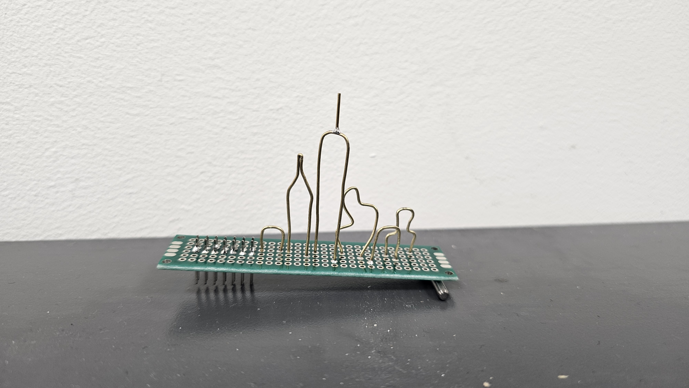
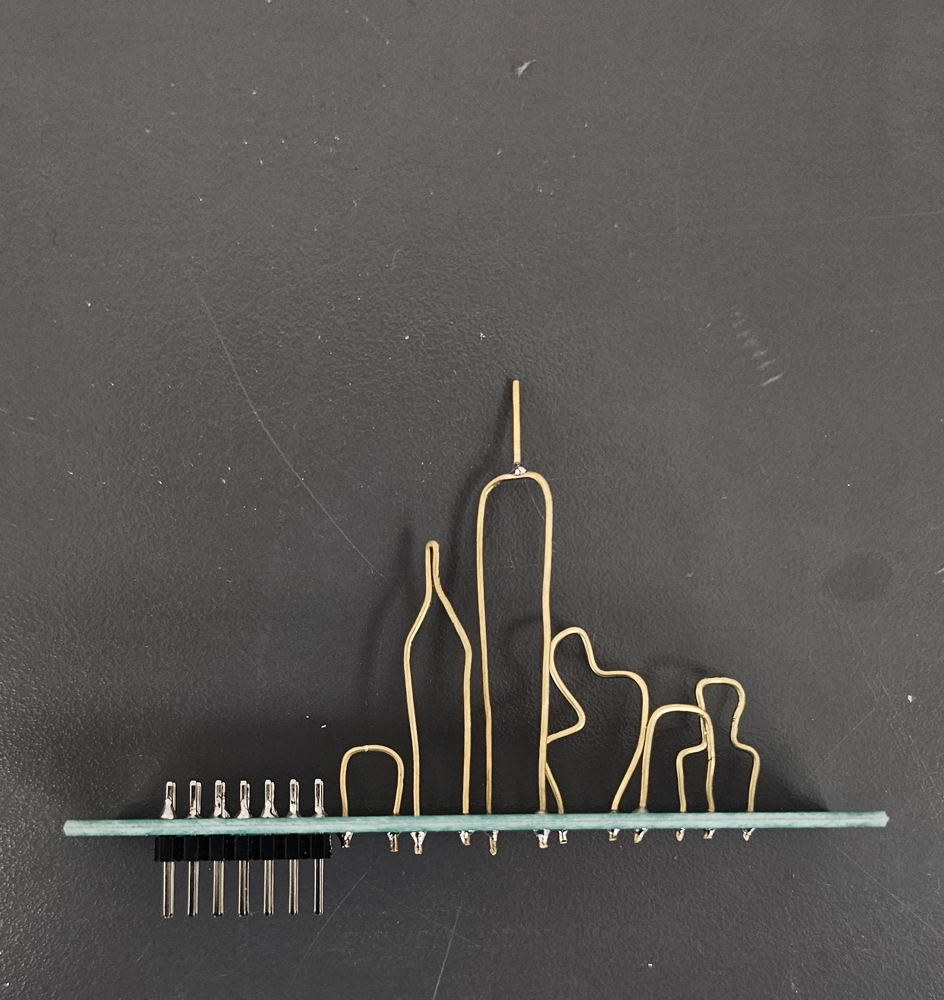

# Creative Embedded Systems Portfolio

---

## Project 1: Manhattan Skyline Soldered

NYC skyline sculpture created using a protoboard, a 12 pin header, a brass rod, a soldering iron, and lead solder. 

---

---

### Reflection

It was really cool learning how to solder for the first time, and it ended up being more intuitive than I expected. Most of my previous hands-on work has been more mechanical and force-based, like drilling, so working delicately with small pins and tiny holes felt very different.

I also enjoyed how open-ended the project felt. Even with relatively simple components, there were a lot of creative possibilities. This made me interested in exploring other contexts where soldering is used in more artistic ways.
